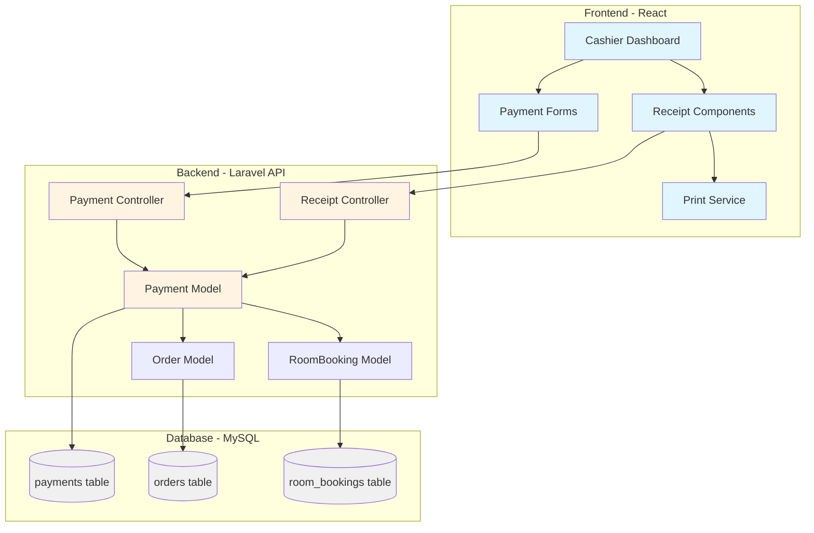
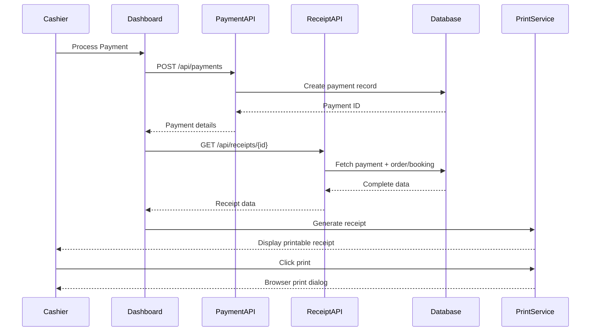

# Design Document: Receipt Generation and Payment Processing System

## Overview

This design document outlines the implementation of a comprehensive receipt generation and payment processing system for the Betesida Restaurant & Hotel Management System. The system will add two critical features: (1) printable receipt generation for both restaurant orders and room bookings, and (2) explicit payment tracking for room bookings that mirrors the existing restaurant payment system.

Currently, the system has full payment processing for restaurant orders but lacks receipt generation. For room bookings, the system creates bookings and tracks check-in/check-out but does not explicitly record payment transactions. This design addresses both gaps by introducing receipt generation components and extending the payment model to support room bookings.

The solution integrates seamlessly with the existing Laravel + React architecture, leveraging the current Payment model for restaurant orders and extending it to support room bookings. Receipt generation will be implemented as reusable React components with browser-based printing capabilities.

## Architecture

The system follows a layered architecture with clear separation between backend payment processing and frontend receipt presentation:



### Component Interaction Flow



## Components and Interfaces

### Component 1: Payment Controller (Extended)

**Purpose**: Handle payment processing for both restaurant orders and room bookings

**Interface**:
```php
class PaymentController extends Controller
{
    // Existing methods
    public function index(): JsonResponse
    public function store(Request $request): JsonResponse
    public function refund($id): JsonResponse
    public function dailyReport(): JsonResponse
    
    // New methods
    public function storeBookingPayment(Request $request): JsonResponse
    public function show($id): JsonResponse
}
```

**Responsibilities**:
- Process payments for restaurant orders (existing)
- Process payments for room bookings (new)
- Calculate tax, service charges, and change
- Link payments to orders or bookings
- Validate payment data
- Return payment details for receipt generation

**Request/Response Schemas**:

*Store Booking Payment Request*:
```json
{
  "booking_id": 1,
  "amount": 1600.00,
  "payment_method": "cash",
  "amount_received": 1600.00,
  "discount": 0.00
}
```

*Payment Response*:
```json
{
  "id": 1,
  "order_id": null,
  "booking_id": 1,
  "cashier_id": 2,
  "amount": 1600.00,
  "discount": 0.00,
  "tax": 0.00,
  "service_charge": 0.00,
  "total": 1600.00,
  "payment_method": "cash",
  "amount_received": 1600.00,
  "change": 0.00,
  "status": "completed",
  "created_at": "2026-05-01T14:00:00Z"
}
```

### Component 2: Receipt Controller (New)

**Purpose**: Generate receipt data for both restaurant orders and room bookings

**Interface**:
```php
class ReceiptController extends Controller
{
    public function getOrderReceipt($paymentId): JsonResponse
    public function getBookingReceipt($paymentId): JsonResponse
    public function getReceiptByPayment($paymentId): JsonResponse
}
```

**Responsibilities**:
- Fetch complete receipt data including payment, order/booking, items, and cashier info
- Format data for frontend consumption
- Support receipt reprinting by payment ID
- Determine receipt type (order vs booking) automatically

**Response Schema for Order Receipt**:
```json
{
  "type": "order",
  "receipt_number": "ORD-001",
  "business_name": "Betesida Restaurant",
  "date": "2026-05-01",
  "time": "14:30:00",
  "table_number": "T05",
  "guest_name": "John Doe",
  "items": [
    {
      "name": "Doro Wot",
      "quantity": 2,
      "price": 250.00,
      "subtotal": 500.00
    }
  ],
  "subtotal": 880.00,
  "tax": 132.00,
  "service_charge": 0.00,
  "discount": 0.00,
  "total": 1012.00,
  "payment_method": "cash",
  "amount_paid": 1100.00,
  "change": 88.00,
  "cashier_name": "Cashier User"
}
```

**Response Schema for Booking Receipt**:
```json
{
  "type": "booking",
  "receipt_number": "BK-001",
  "business_name": "Betesida Hotel",
  "date": "2026-05-01",
  "time": "14:00:00",
  "guest_name": "John Doe",
  "guest_phone": "0911234567",
  "room_number": "R05",
  "room_type": "Double Room",
  "check_in_date": "2026-05-01",
  "check_out_date": "2026-05-03",
  "nights": 2,
  "price_per_night": 800.00,
  "total_amount": 1600.00,
  "payment_method": "cash",
  "amount_paid": 1600.00,
  "change": 0.00,
  "check_in_time": "14:00",
  "check_out_time": "12:00",
  "wifi_ssid": "BetesidaGuest",
  "cashier_name": "Cashier User"
}
```

### Component 3: Receipt Components (React)

**Purpose**: Display and print receipts in the frontend

**Interface**:
```typescript
// OrderReceipt.jsx
interface OrderReceiptProps {
  receiptData: OrderReceiptData;
  onPrint?: () => void;
}

function OrderReceipt({ receiptData, onPrint }: OrderReceiptProps): JSX.Element

// BookingReceipt.jsx
interface BookingReceiptProps {
  receiptData: BookingReceiptData;
  onPrint?: () => void;
}

function BookingReceipt({ receiptData, onPrint }: BookingReceiptProps): JSX.Element

// ReceiptModal.jsx
interface ReceiptModalProps {
  isOpen: boolean;
  receiptData: OrderReceiptData | BookingReceiptData;
  onClose: () => void;
}

function ReceiptModal({ isOpen, receiptData, onClose }: ReceiptModalProps): JSX.Element
```

**Responsibilities**:
- Render receipt layout with proper formatting
- Support both order and booking receipt types
- Provide print button with browser print dialog
- Display in modal overlay for easy viewing
- Apply print-specific CSS for clean output
- Support receipt reprinting from payment history

### Component 4: Print Service (React Utility)

**Purpose**: Handle browser-based printing with proper formatting

**Interface**:
```typescript
class PrintService {
  static printReceipt(elementId: string): void
  static printElement(element: HTMLElement): void
  static setupPrintStyles(): void
}
```

**Responsibilities**:
- Trigger browser print dialog
- Apply print-specific CSS styles
- Hide non-printable elements (buttons, navigation)
- Ensure proper page breaks
- Support thermal printer formatting (80mm width)

## Data Models

### Model 1: Payment (Extended)

```php
class Payment extends Model
{
    protected $fillable = [
        'order_id',
        'booking_id',        // NEW
        'cashier_id',
        'amount',
        'discount',
        'tax',
        'service_charge',
        'total',
        'payment_method',
        'amount_received',   // NEW
        'change',            // NEW
        'status'
    ];
    
    protected $casts = [
        'amount' => 'decimal:2',
        'discount' => 'decimal:2',
        'tax' => 'decimal:2',
        'service_charge' => 'decimal:2',
        'total' => 'decimal:2',
        'amount_received' => 'decimal:2',
        'change' => 'decimal:2',
    ];
    
    public function order()
    {
        return $this->belongsTo(Order::class);
    }
    
    public function booking()  // NEW
    {
        return $this->belongsTo(RoomBooking::class, 'booking_id');
    }
    
    public function cashier()
    {
        return $this->belongsTo(User::class, 'cashier_id');
    }
}
```

**Validation Rules**:
- Either `order_id` OR `booking_id` must be present (not both)
- `amount` must be positive decimal
- `payment_method` must be one of: cash, card, mobile_money
- `amount_received` must be >= `total` for cash payments
- `change` must equal `amount_received - total` for cash payments
- `status` must be one of: pending, completed, refunded

**Database Migration**:
```php
Schema::table('payments', function (Blueprint $table) {
    $table->foreignId('booking_id')->nullable()->after('order_id')
          ->constrained('room_bookings')->onDelete('cascade');
    $table->decimal('amount_received', 10, 2)->nullable()->after('total');
    $table->decimal('change', 10, 2)->default(0)->after('amount_received');
});
```

### Model 2: RoomBooking (Extended)

```php
class RoomBooking extends Model
{
    // Existing fields remain unchanged
    
    // New relationship
    public function payment()
    {
        return $this->hasOne(Payment::class, 'booking_id');
    }
}
```

**No schema changes needed** - relationship is established through the Payment model's `booking_id` foreign key.

## Error Handling

### Error Scenario 1: Payment Processing Failure

**Condition**: Database transaction fails during payment creation
**Response**: 
- Roll back transaction
- Return HTTP 500 with error message
- Log error details for debugging
**Recovery**: 
- User can retry payment
- No partial data is saved
- Order/booking status remains unchanged

**Example Response**:
```json
{
  "error": "Failed to process payment",
  "message": "Database transaction failed",
  "code": "PAYMENT_FAILED"
}
```

### Error Scenario 2: Receipt Data Not Found

**Condition**: Payment ID does not exist or is deleted
**Response**: 
- Return HTTP 404 with error message
**Recovery**: 
- User is notified receipt cannot be generated
- Suggest checking payment history

**Example Response**:
```json
{
  "error": "Receipt not found",
  "message": "Payment with ID 123 does not exist",
  "code": "RECEIPT_NOT_FOUND"
}
```

### Error Scenario 3: Invalid Payment Amount

**Condition**: Amount received is less than total for cash payment
**Response**: 
- Return HTTP 422 with validation error
**Recovery**: 
- Display error to cashier
- Prompt for correct amount

**Example Response**:
```json
{
  "error": "Validation failed",
  "errors": {
    "amount_received": ["Amount received must be greater than or equal to total"]
  }
}
```

### Error Scenario 4: Print Failure

**Condition**: Browser print dialog is cancelled or fails
**Response**: 
- Display user-friendly message
- Keep receipt modal open
**Recovery**: 
- User can retry printing
- Receipt data remains available

## Testing Strategy

### Unit Testing Approach

**Backend (PHPUnit)**:
- Test payment creation for orders
- Test payment creation for bookings
- Test payment validation rules
- Test receipt data generation
- Test change calculation
- Test tax and service charge calculation
- Mock database interactions

**Key Test Cases**:
```php
// PaymentControllerTest.php
public function test_can_create_order_payment()
public function test_can_create_booking_payment()
public function test_validates_payment_amount()
public function test_calculates_change_correctly()
public function test_prevents_duplicate_booking_payment()
public function test_requires_order_or_booking_id()

// ReceiptControllerTest.php
public function test_generates_order_receipt_data()
public function test_generates_booking_receipt_data()
public function test_returns_404_for_invalid_payment()
public function test_includes_all_required_fields()
```

**Frontend (Jest + React Testing Library)**:
- Test receipt component rendering
- Test print button functionality
- Test modal open/close behavior
- Test data formatting
- Test conditional rendering based on receipt type

**Key Test Cases**:
```javascript
// OrderReceipt.test.jsx
test('renders order receipt with all items')
test('displays correct total calculations')
test('shows change for cash payments')
test('calls print function when button clicked')

// BookingReceipt.test.jsx
test('renders booking receipt with room details')
test('displays check-in and check-out dates')
test('shows correct number of nights')
test('includes WiFi information')

// ReceiptModal.test.jsx
test('opens modal when isOpen is true')
test('closes modal when close button clicked')
test('renders correct receipt type')
```

### Integration Testing Approach

**API Integration Tests**:
- Test complete payment flow from request to database
- Test receipt generation with real database data
- Test payment-to-order/booking relationships
- Test cashier authentication and authorization

**Key Integration Tests**:
```php
public function test_complete_order_payment_flow()
{
    // 1. Create order
    // 2. Process payment
    // 3. Verify payment record
    // 4. Verify order status updated
    // 5. Generate receipt
    // 6. Verify receipt data
}

public function test_complete_booking_payment_flow()
{
    // 1. Create booking
    // 2. Check in guest
    // 3. Process payment
    // 4. Verify payment record
    // 5. Verify booking status updated
    // 6. Generate receipt
    // 7. Verify receipt data
}
```

**Frontend Integration Tests**:
- Test payment form submission to API
- Test receipt modal display after payment
- Test print functionality with mocked window.print
- Test error handling for failed API calls

### End-to-End Testing Approach

**User Workflow Tests** (Cypress or Playwright):

1. **Restaurant Order Payment Flow**:
   - Login as cashier
   - Navigate to pending orders
   - Select order
   - Click "Process Payment"
   - Enter payment details
   - Submit payment
   - Verify receipt modal appears
   - Verify receipt contains correct data
   - Click print button
   - Verify print dialog opens

2. **Room Booking Payment Flow**:
   - Login as cashier
   - Navigate to bookings
   - Select confirmed booking
   - Click "Check In"
   - Enter payment details
   - Submit payment
   - Verify receipt modal appears
   - Verify receipt contains room number and dates
   - Click print button
   - Verify print dialog opens

3. **Receipt Reprint Flow**:
   - Login as cashier
   - Navigate to payment history
   - Select past payment
   - Click "Reprint Receipt"
   - Verify receipt modal appears
   - Verify data matches original

## Performance Considerations

### Database Query Optimization

**Challenge**: Receipt generation requires joining multiple tables (payments, orders/bookings, items, users)

**Solution**: Use eager loading to prevent N+1 queries
```php
// Optimized query for order receipt
$payment = Payment::with([
    'order.orderItems.menuItem',
    'order.table',
    'cashier'
])->findOrFail($paymentId);

// Optimized query for booking receipt
$payment = Payment::with([
    'booking.room',
    'cashier'
])->findOrFail($paymentId);
```

**Expected Performance**: 
- Single receipt generation: < 100ms
- Payment list with 50 records: < 200ms

### Frontend Rendering Optimization

**Challenge**: Large receipt lists may cause slow rendering

**Solution**: 
- Implement pagination for payment history (20 per page)
- Use React.memo for receipt components
- Lazy load receipt modal content
- Debounce search/filter inputs

### Print Performance

**Challenge**: Browser print dialog may be slow for complex receipts

**Solution**:
- Minimize CSS complexity in print styles
- Use simple table layouts instead of flexbox/grid
- Optimize image sizes (if logos are added)
- Remove unnecessary DOM elements before printing

## Security Considerations

### Authentication and Authorization

**Requirement**: Only cashiers and managers can process payments and generate receipts

**Implementation**:
```php
// In routes/api.php
Route::middleware(['auth:sanctum', 'role:cashier,manager'])->group(function () {
    Route::post('/payments', [PaymentController::class, 'store']);
    Route::post('/payments/bookings', [PaymentController::class, 'storeBookingPayment']);
    Route::get('/receipts/{paymentId}', [ReceiptController::class, 'getReceiptByPayment']);
});
```

**Frontend Protection**:
- Hide payment buttons for non-cashier users
- Redirect unauthorized users attempting to access payment routes
- Display appropriate error messages for authorization failures

### Data Validation

**Input Validation**:
- Sanitize all user inputs (amounts, payment methods)
- Validate decimal precision for monetary values
- Prevent negative amounts or change
- Ensure payment method is from allowed list
- Validate foreign key references exist

**SQL Injection Prevention**:
- Use Laravel's Eloquent ORM (parameterized queries)
- Never concatenate user input into raw SQL
- Validate all request parameters

### Payment Integrity

**Prevent Duplicate Payments**:
```php
// Check if booking already has payment
$existingPayment = Payment::where('booking_id', $bookingId)
    ->where('status', 'completed')
    ->exists();

if ($existingPayment) {
    return response()->json([
        'error' => 'Payment already exists for this booking'
    ], 400);
}
```

**Transaction Atomicity**:
- Wrap payment creation and status updates in database transactions
- Roll back on any failure
- Ensure consistent state

### Sensitive Data Protection

**Receipt Data**:
- Do not expose full credit card numbers (if card payments are added)
- Mask sensitive guest information in logs
- Use HTTPS for all API communications
- Implement rate limiting on receipt endpoints

## Dependencies

### Backend Dependencies (Laravel)

**Existing Dependencies** (already in composer.json):
- `laravel/framework: ^11.0` - Core framework
- `laravel/sanctum: ^4.0` - API authentication
- `doctrine/dbal: ^3.0` - Database schema modifications

**No new backend dependencies required**

### Frontend Dependencies (React)

**Existing Dependencies** (already in package.json):
- `react: ^18.0` - Core library
- `react-dom: ^18.0` - DOM rendering
- `axios: ^1.0` - HTTP client
- `react-router-dom: ^6.0` - Routing

**New Dependencies Required**:
- `react-to-print: ^2.15.0` - Enhanced print functionality (optional, can use native window.print)
- `date-fns: ^2.30.0` - Date formatting for receipts

**Installation**:
```bash
cd frontend
npm install date-fns
# Optional: npm install react-to-print
```

### System Dependencies

**Required**:
- PHP >= 8.2
- MySQL >= 8.0
- Node.js >= 18.0
- Composer >= 2.0
- NPM >= 9.0

**Browser Requirements**:
- Modern browser with print API support (Chrome, Firefox, Safari, Edge)
- JavaScript enabled
- Cookies enabled (for authentication)

### External Services

**None required** - All functionality is self-contained within the application. No third-party APIs or services are needed for receipt generation or payment processing.

**Optional Future Enhancements**:
- PDF generation service (e.g., DomPDF, Puppeteer) for downloadable receipts
- Email service (e.g., SendGrid, Mailgun) for emailing receipts to guests
- SMS service (e.g., Twilio) for sending receipt links via SMS

## Implementation Notes

### Database Migration Strategy

1. Create migration for extending payments table
2. Run migration in development environment
3. Test payment creation for both orders and bookings
4. Verify foreign key constraints
5. Deploy to production with backup

### API Route Structure

```
POST   /api/payments                    - Create order payment (existing)
POST   /api/payments/bookings           - Create booking payment (new)
GET    /api/payments/{id}               - Get payment details (new)
GET    /api/receipts/payment/{id}       - Get receipt data (new)
GET    /api/receipts/order/{paymentId}  - Get order receipt (new)
GET    /api/receipts/booking/{paymentId}- Get booking receipt (new)
```

### Frontend Route Structure

```
/cashier/orders          - Order management with payment button
/cashier/bookings        - Booking management with check-in/payment
/cashier/payments        - Payment history with reprint option
```

### Component File Structure

```
frontend/src/
├── components/
│   ├── receipts/
│   │   ├── OrderReceipt.jsx
│   │   ├── BookingReceipt.jsx
│   │   ├── ReceiptModal.jsx
│   │   └── ReceiptPrintButton.jsx
│   └── payments/
│       ├── PaymentForm.jsx
│       └── BookingPaymentForm.jsx
├── services/
│   ├── paymentService.js
│   ├── receiptService.js
│   └── printService.js
└── styles/
    └── receipt.css
```

### Styling Considerations

**Print-Specific CSS**:
```css
@media print {
  /* Hide navigation, buttons, and non-receipt elements */
  .no-print {
    display: none !important;
  }
  
  /* Optimize for thermal printer (80mm width) */
  @page {
    size: 80mm auto;
    margin: 0;
  }
  
  /* Ensure receipt fits on one page */
  .receipt {
    page-break-inside: avoid;
  }
}
```

**Receipt Layout**:
- Use monospace font for alignment
- Center-align header and footer
- Left-align item details
- Right-align prices
- Use borders for visual separation
- Support both A4 and thermal printer formats

### Backward Compatibility

**Existing Payment Records**:
- Old payment records (without `booking_id`) remain valid
- `booking_id` is nullable to support existing data
- Receipt generation checks which type of payment (order or booking)

**API Versioning**:
- No breaking changes to existing endpoints
- New endpoints are additive
- Existing frontend code continues to work

### Deployment Checklist

1. ✅ Run database migration
2. ✅ Deploy backend code
3. ✅ Deploy frontend code
4. ✅ Test order payment flow
5. ✅ Test booking payment flow
6. ✅ Test receipt printing
7. ✅ Verify cashier permissions
8. ✅ Test on different browsers
9. ✅ Test thermal printer compatibility (if available)
10. ✅ Train cashier staff on new features
